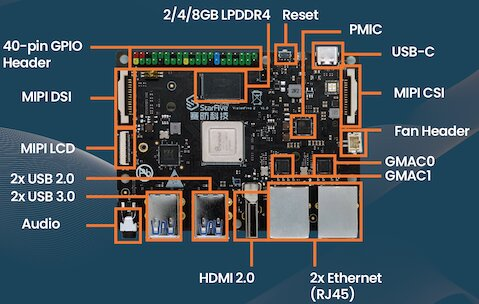
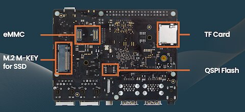

# module1 · Компоненты платы

← [Назад (README)](README.md) · [На главную](../INDEX.md) · [Следующий →](module2-jh7110.md)

---

## Что на плате

### Лицевая сторона



### Обратная сторона



---

## Компоненты и их назначение

Короткий обзор каждого блока. Детальный разбор SoC и GPIO — в следующих
модулях; здесь важно сформировать общую картину того, что присутствует
на плате физически.

---

**JH7110 SoC** — центральный чип. Внутри него находятся: процессорные
ядра RISC-V, контроллер памяти, GPU, и десятки периферийных блоков — GPIO,
UART, I2C, SPI, USB, PCIe, Ethernet MAC, MIPI и другие.
Детальное рассмотрение — в [module2](module2-jh7110.md).

**LPDDR4** — оперативная память, подключённая к SoC через выделенный
контроллер. Объём зависит от ревизии платы. Плата стенда (v1.3B), которая
задействована при составлении курса, оснащена 8 ГБ: физический диапазон
`0x40000000`–`0x23FFFFFFF`, из которых первые 512 КБ зарезервированы под
OpenSBI (Supervisor Binary Interface (SBI) - промежуточный слой между
прошивкой (M-mode) и операционной системой (S-mode) - будет рассматриваться
позднее в следующих уроках).

```bash
# Объём и использование памяти
$ free -h
               total        used        free      shared  buff/cache   available
Mem:           7,7Gi       455Mi       7,0Gi        27Mi       407Mi       7,3Gi
Swap:             0B          0B          0B

# Физический диапазон RAM и зарезервированные области
$ sudo grep -E "System RAM|Reserved" /proc/iomem

40000000-4007ffff : Reserved
40080000-23fffffff : System RAM
  40200000-40201fff : Reserved
  426ef8f0-427fffff : Reserved
  46000000-4600efff : Reserved
  46100000-46990fff : Reserved
  69c00000-6bbfffff : Reserved
  6bc00000-6cc00fff : Reserved
  6ce00000-6e3fffff : Reserved
  70000000-cfffffff : Reserved
  fbfff000-ffffefff : Reserved
  23726b000-23732afff : Reserved
  23732b000-237f2bfff : Reserved
  237f2c000-237fa7fff : Reserved
  237faa000-237faafff : Reserved
  237fab000-23ffabfff : Reserved
  23ffac000-23fffffff : Reserved
```

**QSPI Flash (16 MiB)** — эта микросхема расположена на обратной стороне
платы и содержит первичные копии загрузчиков. С неё процессор начинает
чтение кода по умолчанию (режим Boot Mode [0:0]). В рамках курса этот
режим не используется, так как мы работаем с обновленными версиями на
SD-карте, однако полезно знать структуру этой памяти.

Ядро Linux узнает о разметке этой памяти из дерева устройств
(Device Tree - будет рассматриваться позднее в следующих уроках).

Вы можете проверить это самостоятельно, декомпилировав текущее дерево из
операционной системы:

```bash
# Просмотр узла flash в дереве устройств
$ dtc -I fs /proc/device-tree 2>/dev/null | grep -A 25 "flash@0 {"
                        flash@0 {
                                cdns,tshsl-ns = <0x01>;
                                spi-max-frequency = <0xb71b00>;
                                cdns,tsd2d-ns = <0x01>;
                                cdns,read-delay = <0x05>;
                                cdns,tslch-ns = <0x01>;
                                compatible = "jedec,spi-nor";
                                reg = <0x00>;
                                phandle = <0x97>;
                                cdns,tchsh-ns = <0x01>;

                                partitions {
                                        #address-cells = <0x01>;
                                        #size-cells = <0x01>;
                                        compatible = "fixed-partitions";

                                        uboot-env@f0000 {
                                                reg = <0xf0000 0x10000>;
                                        };

                                        spl@0 {
                                                reg = <0x00 0xf0000>;
                                        };

                                        uboot@100000 {
                                                reg = <0x100000 0xf00000>;
```
В выводе виден блок partitions, где жестко заданы адреса и размеры (свойство
reg в формате <смещение размер>):

```
# Фрагмент из Device Tree
partitions {
    compatible = "fixed-partitions";

    spl@0 {
        reg = <0x00 0xf0000>;         /* 0x000000–0x0EFFFF (960 КБ) */
    };
    uboot-env@f0000 {
        reg = <0xf0000 0x10000>;      /* 0x0F0000–0x0FFFFF (64 КБ)  */
    };
    uboot@100000 {
        reg = <0x100000 0xf00000>;    /* 0x100000–0xFFFFFF (15 МБ)  */
    };
};
```

На основе этих данных из Device Tree ядро создает устройства
**MTD (Memory Technology Device)**. Это специальный слой для работы с «сырой»
флеш-памятью, которая не имеет собственного контроллера (в отличие от SD-карт).

Проверить, как ОС увидела эти разделы, можно командой:

```bash
$ cat /proc/mtd
dev:    size   erasesize  name
mtd0: 000f0000 00001000 "spl"
mtd1: 00010000 00001000 "uboot-env"
mtd2: 00f00000 00001000 "uboot"
```

> SPL инициализирует DRAM и передаёт управление U-Boot, который уже
> ищет ядро на загрузочном носителе.

**TF Card (MicroSD)** — это основной носитель. При правильной настройке
dip-переключателей (см. [Подключение к консоли](../setup.md#3-подключение-к-консоли))
плата игнорирует QSPI и загружает **SPL** и **U-Boot** прямо с MicroSD.

Образ ALT Linux использует современную разметку GPT. Посмотреть детальную
структуру секторов можно командой gdisk:

```bash
$ sudo gdisk -l /dev/mmcblk1 | tail -5
Number  Start (sector)    End (sector)  Size       Code  Name
   1            4096            8191   2.0 MiB     FFFF  spl
   2            8192           16383   4.0 MiB     EA00  uboot
   3           16384          614399   292.0 MiB   0700  kernel
   4          614400        62447582   29.5 GiB    8300  root
```

Разбор разделов SD-карты:

* **Разделы 1 (spl) и 2 (uboot):** Это «служебные» разделы.
    * Обратите внимание на **Code (FFFF и EA00)** — это специфические идентификаторы для RISC-V.
    * На этих разделах **нет файловой системы**. Данные записаны туда в «сыром» виде (binary blob). Процессор и SPL считывают их по прямым адресам секторов. Именно поэтому в `lsblk` у них нет точек монтирования.
* **Раздел 3 (kernel):** Здесь находится файловая система (обычно FAT32 или EXT4), содержащая само ядро Linux (`vmlinuz`), RAM-диск (`initrd`) и дерево устройств (`.dtb`). В системе он монтируется в `/boot/BOOT`.
* **Раздел 4 (root):** Основной раздел с операционной системой (RootFS). Код **8300** означает стандартный *Linux filesystem*.

**M.2 M-key** — подключён к PCIe 2.0. Предназначен для NVMe SSD. Для курса
не используется (не обязательно), но есть подробная инструкция [как](../setup.md#8-Перенос-корневой-системы-на-NVMe-SSD-опционально).

**eMMC** — модульный разъём на обратной стороне. Контроллер (mmc@16010000)
активен, поддерживает HS200 и DDR на 1.8V. В текущей конфигурации
eMMC-модуль не установлен, но драйвер инициализирован.

**40-pin GPIO Header** — основной рабочий разъём курса, вдоль длинного
края платы. Механически совместим с Raspberry Pi HAT по расположению
пинов питания (3.3 В, 5 В, GND), однако GPIO-номера и доступные функции
определяются JH7110. Детальная распиновка — в [module3](module3-pinout.md).

**UART** — в данной конфигурации активен только UART0 (`serial@10000000`,
`/dev/ttyS0`, 115200 8N1). Именно через него идёт системная консоль.
UART1–UART5 отключены в DTS (`status = "disabled"`). Подробнее — в
разделе диагностики ниже.

**HDMI 2.0** — физически это DisplayPort-выход, оформленный через мост
внутри JH7110. Подключён к GPU (img-gpu @ `0x18000000`). Контроллер
дисплея — dc8200 @ `0x29400000`, HDMI-передатчик — `0x29590000`.

**GMAC0 / GMAC1** — два порта Gigabit Ethernet. В системе определяются
как `end0` и `end1` (Predictable Network Interface Names по MAC-адресу),
а не `eth0`/`eth1`. Оба используют PHY производства Motorcomm (YT8531).
MAC-адреса прошиты в DTS: `6c:cf:39:00:ba:ac` и `6c:cf:39:00:ba:ad`.

**USB** — четыре порта Type-A. USB 3.0 реализован через внешний чип
VIA VL805, подключённый по PCIe (`0000:01:00.0`). USB 2.0 и OTG
управляются встроенным контроллером JH7110 (`usb@10100000`, Cadence USB3,
режим `peripheral`).

**USB-C** — только питание (5 В / 3 А). USB-данные через этот разъём
не проходят.

**PMIC** — контроллер питания X-Powers AXP15060, подключённый по I2C
(`i2c@12050000`, адрес `0x36`). Управляет питанием SoC и памяти:
- `vdd-cpu` (dcdc2): 0.5–1.55 В, динамически изменяется при смене частоты CPU
- `vcc_3v3` (dcdc1): 3.3 В, всегда включён
- `hdmi_0p9` / `hdmi_1p8`: питание HDMI-блока
- `mipi_0p9`: питание MIPI-блока
- `emmc_vdd`: питание eMMC

**Thermal** — встроенный датчик температуры JH7110 (`temperature-sensor@120e0000`).
Пороги заданы в DTS: предупреждение при 85°C (троттлинг CPU), критический
останов при 100°C.

Посмотреть текущую температуру процессора можно командой:
```bash
$ cat /sys/class/thermal/thermal_zone0/temp 
50238
```
Что соответствует ~50 °C .

**Fan Header** — 2-пиновый разъём для подключения кулера.

**MIPI CSI / MIPI DSI** — разъёмы FPC. DSI-контроллер активен в DTS
(`mipi@295d0000`, status okay). В DTS прописаны три варианта камер:
Sony IMX219, Sony IMX708, OmniVision OV4689. В рамках курса не используются.

---

## Первичная диагностика

### `/proc/cpuinfo`

```bash
$ cat /proc/cpuinfo | head
processor       : 0
hart            : 1
isa             : rv64imafdc_zicntr_zicsr_zifencei_zihpm_zca_zcd_zba_zbb
mmu             : sv39
uarch           : sifive,u74-mc
mvendorid       : 0x489
marchid         : 0x8000000000000007
mimpid          : 0x4210427
hart isa        : rv64imafdc_zicntr_zicsr_zifencei_zihpm_zca_zcd_zba_zbb
```

`processor: 0..3` — четыре логических CPU с точки зрения Linux.
`hart: 1..4` — аппаратные потоки RISC-V. Hart 0 — это ядро S7, оно
отключено в DTS (`status = "disabled"`) и полностью отдано OpenSBI
для обслуживания M-mode. Linux работает на hartах 1–4 (четыре ядра U74).

`isa` — поддерживаемые расширения: `rv64imafdc` (базовый набор + FPU),
`zicntr/zihpm` (счётчики производительности), `zicsr` (CSR-инструкции),
`zifencei` (синхронизация I/D кэшей), `zca/zcd` (сжатые инструкции),
`zba/zbb` (битовые операции).

`mmu: sv39` — 39-битное виртуальное пространство (512 ГиБ),
трёхуровневые таблицы страниц.

`mvendorid: 0x489` — идентификатор SiFive (производитель IP-ядер).

### `/proc/iomem`

```bash
$ sudo cat /proc/iomem
```

```
10000000-1000ffff : serial                         ← UART0, системная консоль
10030000-1003ffff : 10030000.i2c i2c@10030000      ← I2C0
10050000-1005ffff : 10050000.i2c i2c@10050000      ← I2C2
10060000-1006ffff : spi@10060000                   ← SPI0
  10060000-1006ffff : ssp-pl022
100b0000-100b0fff : pwmdac@100b0000
10100000-1010ffff : 10100000.usb otg
13040000-1304ffff : 13040000.pinctrl pinctrl@13040000  ← sys_iomux, GPIO 0–63
17020000-1702ffff : 17020000.pinctrl pinctrl@17020000  ← aon_iomux, GPIO 64–67
16008000-1600bfff : pl08xdmac
1600c000-1600ffff : 1600c000.rng rng@1600c000
16010000-1601ffff : 16010000.mmc mmc@16010000      ← eMMC
16020000-1602ffff : 16020000.mmc mmc@16020000      ← MicroSD
16030000-1603ffff : 16030000.ethernet ethernet@16030000  ← GMAC0 (end0)
16040000-1604ffff : 16040000.ethernet ethernet@16040000  ← GMAC1 (end1)
16050000-1605ffff : 16050000.dma-controller        ← AXI DMA
40080000-23fffffff : System RAM                    ← 8 ГБ LPDDR4
  40202000-426ef8ef : Kernel image
```

CLINT (`0x02000000`) и PLIC (`0x0C000000`) присутствуют в DTS, но
в `/proc/iomem` не отображаются. CLINT работает в M-mode и полностью
скрыт за OpenSBI — Linux обращается к нему через SBI-вызовы. PLIC
управляется irqchip-драйвером, который не резервирует регион через
`request_mem_region`.

### `lspci`

```bash
$ lspci 
0000:00:00.0 PCI bridge: PLDA XpressRich-AXI Ref Design (rev 02)
0000:01:00.0 USB controller: VIA Technologies, Inc. VL805/806 xHCI USB 3.0 Controller (rev 01)
0001:00:00.0 PCI bridge: PLDA XpressRich-AXI Ref Design (rev 02)
```

Два PCIe-домена (`0000:` и `0001:`) соответствуют двум PCIe-контроллерам
JH7110. Root bridge в каждом домене — PLDA XpressRich-AXI (PCIe IP-блок
внутри JH7110). За ними:

- `VIA VL805` — внешний USB 3.0 хаб-контроллер, реализующий порты SuperSpeed
  на плате. Несмотря на наличие встроенного USB в JH7110, именно этот чип
  обеспечивает USB 3.0.

### `lsusb`

```bash
$ lsusb
Bus 001 Device 001: ID 1d6b:0002 Linux Foundation 2.0 root hub
Bus 001 Device 002: ID 2109:3431 VIA Labs, Inc. Hub
Bus 002 Device 001: ID 1d6b:0003 Linux Foundation 3.0 root hub
```

`1d6b:0002/0003` — виртуальные root hub, которые ядро создаёт для
каждого USB-хост-контроллера. Bus 001 (USB 2.0) и Bus 002 (USB 3.0).
`2109:3431` — встроенный хаб на чипе VIA VL805, через который разведены
физические порты Type-A. Пользовательских устройств не подключено.

### `ip link show`

```bash
$ ip link show
```

```
2: end0: <...UP...>  link/ether 6c:cf:39:00:ba:ac   ← GMAC0, кабель подключён
3: end1: <...DOWN...> link/ether 6c:cf:39:00:ba:ad  ← GMAC1, кабель не подключён
```

Интерфейсы называются `end0`/`end1`, а не `eth0`/`eth1` — это результат
работы **Predictable Network Interface Names** в systemd-udev. Имя
формируется из MAC-адреса: `en` (Ethernet) + `x` (по MAC) +
`6ccf3900baac`.

### UART и системная консоль

```bash
$ sudo dmesg | grep -i "tty\|uart\|serial"
```

```
[    0.000000] earlycon: uart0 at MMIO32 0x10000000 (options '115200n8')
[    3.385713] 10000000.serial: ttyS0 at MMIO 0x10000000 (irq=68) is a 16550A
```

В системе зарегистрирован только `ttyS0` (`0x10000000`, UART0) —
системная консоль, 115200 8N1. UART1–UART5 присутствуют в DTS, но все
имеют `status = "disabled"` и драйвером не инициализируются. Проверить
можно так:

```bash
# Все serial-узлы в DTS и их статус
$ dtc -I fs /proc/device-tree 2>/dev/null | grep -A3 "serial@"
```

---

## Источники

- VisionFive2 Quick Start Guide — [doc-en.rvspace.org/VisionFive2/QSG](https://doc-en.rvspace.org/VisionFive2/Quick_Start_Guide/)
- VisionFive2 Hardware Design Guide — [doc-en.rvspace.org/VisionFive2/HW](https://doc-en.rvspace.org/VisionFive2/Hardware_Design_Guide/)

---

← [Назад (README)](README.md) · [На главную](../INDEX.md) · [Следующий →](module2-jh7110.md)
