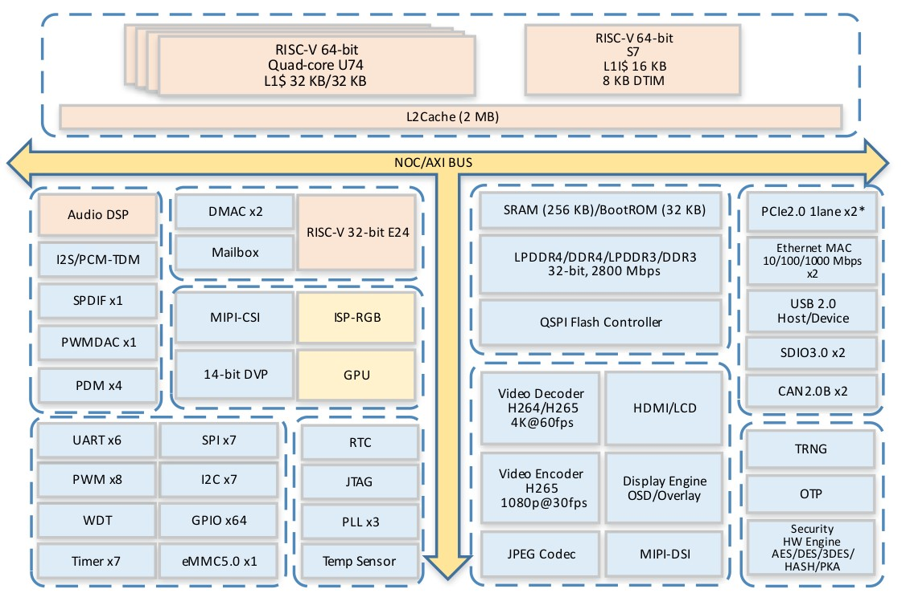

# module2 · SoC JH7110: ядра, шины, карта памяти

← [Назад](module1-overview.md) · [На главную](../INDEX.md) · [Следующий →](module3-pinout.md)

> **TRM:** [doc-en.rvspace.org/JH7110/TRM](https://doc-en.rvspace.org/JH7110/TRM/)
>          [**System Architecture**](https://doc-en.rvspace.org/JH7110/TRM/JH7110_TRM/system_architecture.html),

---

## Блок-схема JH7110

**TRM ref:** [**Block Diagram**](https://doc-en.rvspace.org/JH7110/TRM/JH7110_DS/c_block_diagram.html)



Блок-схема — первое, что стоит открыть перед работой с любым SoC.
Она показывает, какие блоки существуют, как они соединены и через какую
шину общаются с процессором. Всё остальное в этом модуле — расшифровка
того, что на ней изображено и что подтверждается реальным DTS платы.

---

## Процессорные ядра

Внутри JH7110 три разных процессорных ядра. В DTS они описаны в секции
`/cpus` и пронумерованы как hart 0–4.

Посмотреть в less:
```bash
$ dtc -I fs /proc/device-tree 2>/dev/null | less
```

### SiFive U74 (×4) — основные ядра, hart 1–4

Именно на них работает Linux. В DTS: `cpu@1`–`cpu@4`,
`compatible = "sifive,u74-mc"`.

| Параметр | Значение |
|----------|----------|
| ISA | `rv64imafdc_zba_zbb` (из DTS) |
| ISA расширенная | `rv64imafdc_zicntr_zicsr_zifencei_zihpm_zca_zcd_zba_zbb` (из `/proc/cpuinfo`) |
| Pipeline | In-order, 8-stage |
| L1 I-cache | 32 KiB, 4-way (d-cache-size = 0x8000) |
| L1 D-cache | 32 KiB, 4-way |
| L2 cache | 2 MiB shared (cache-controller@2010000) |
| TLB | 40 записей I/D, split (tlb-split) |
| Питание | vdd-cpu от PMIC AXP15060 (dcdc2, 0.5–1.55 В) |
| OPP | 375/500/750/1500 МГц |

Частотные ступени (Operating Performance Points) заданы в DTS в узле
`opp-table-0`. Напряжение на каждой ступени:

```
375  МГц → 0.9 В
500  МГц → 0.9 В
750  МГц → 0.9 В  (opp-suspend — используется при suspend)
1500 МГц → 1.06 В
```

### SiFive S7 (×1) — hart 0, отключён в данной конфигурации

В DTS: `cpu@0`, `compatible = "sifive,s7"`, **`status = "disabled"`**.
Hart 0 зарезервирован под OpenSBI и Linux его не видит: именно поэтому
в `/proc/cpuinfo` отображаются processor 0–3 с hart 1–4, а не hart 0–3.

| Параметр | Значение |
|----------|----------|
| ISA | `rv64imac_zba_zbb` (без FPU) |
| I-cache | 16 KiB (i-cache-size = 0x4000) |
| D-cache | нет |

### SiFive E24 (×1) — вспомогательное ядро реального времени

В DTS: `e24@6e210000`, `compatible = "starfive,e24"`, `status = "okay"`.
32-битное RV32 ядро для задач реального времени. Прошивается независимо
(`firmware-name = "e24_elf"`). Общается с основной системой через
Mailbox (`mailbox@13060000`). Под свои нужды зарезервирован регион RAM:
`e24@c0000000` (0x6CE00000, 22 МБ).

В стандартной конфигурации курса E24 не используется напрямую, однако
его наличие объясняет появление `mailbox@13060000` в `/proc/iomem`.

---

## Что ещё находится внутри SoC

Полный перечень периферии, видимой в DTS данной платы:

**Последовательные интерфейсы**
- UART × 6: `serial@10000000`–`@10050000`, `@12000000`–`@12020000`. Активен только UART0.
- I2C × 7: `i2c@10030000`, `@10040000`, `@10050000`, `@12030000`–`@12060000`. Активны: I2C0, I2C2, I2C5, I2C6.
- SPI × 7: `spi@10060000`–`@10080000`, `@12070000`–`@120a0000`. Активен только SPI0.
- QSPI NOR Flash: `spi@13010000` (Cadence QSPI, 16 МБ, 3 раздела).

**Хранение данных**
- eMMC: `mmc@16010000`, HS200, 8-bit, до 100 МГц.
- MicroSD: `mmc@16020000`, SD-only (no-mmc, no-sdio), 4-bit, до 100 МГц.

**Сеть**
- GMAC0: `ethernet@16030000`, RGMII, PHY Motorcomm YT8531, MAC `6c:cf:39:00:ba:ac`.
- GMAC1: `ethernet@16040000`, RGMII, PHY Motorcomm, MAC `6c:cf:39:00:ba:ad`.

**USB**
- USB OTG: `usb@10100000` (Cadence USB3), режим `peripheral`, PHY `phy@10200000`.
- USB 3.0 Host: VIA VL805 за PCIe (домен 0000:).

**PCIe**
- PCIe 0 (`pcie@940000000`): домен `0000:`, подключён VIA VL805.
- PCIe 1 (`pcie@9c0000000`): домен `0001:`, можно подключить NVMe SSD.
- Оба используют PCIe PHY JH7110 и IP-блок PLDA XpressRich-AXI.

**Видео и дисплей**
- GPU: `gpu@18000000` (img-gpu, StarFive BXE-4-32), status okay.
- Display controller: `dc8200@29400000`, поддерживает три выхода (HDMI, DSI, RGB).
- HDMI: `hdmi@29590000` (inno,hdmi), статус okay.
- MIPI DSI: `mipi@295d0000` (cdns,dsi), статус okay.
- MIPI CSI: `csi@19800000` (cdns,csi2rx), статус disabled.
- VIN/ISP: `vin_sysctl@19800000`, `isp@19840000`, статус okay/disabled.

**Мультимедиа**
- VPU декодер: `vpu_dec@130a0000` (H.264/H.265 4K@60fps), статус okay.
- VPU энкодер: `vpu_enc@130b0000` (H.265 1080p@30fps), статус okay.
- JPEG кодек: `jpu@13090000`, статус okay.
- I2S TX/RX, SPDIF, PDM, TDM, PWMDAC — аудиоподсистема, частично активна.

**Системные блоки**
- DMA: `dma-controller@16008000` (ARM PL080) + `dma-controller@16050000` (DesignWare AXI DMA, 4 канала).
- Mailbox: `mailbox@13060000` — межпроцессорная коммуникация с E24.
- CAN × 2: `can@130d0000`, `can@130e0000` — оба disabled.
- PWM: `pwm@120d0000`, статус okay.
- Timer: `timer@13050000` (4 канала), Watchdog: `watchdog@13070000`.
- RTC: `rtc@17040000`.
- TRNG: `rng@1600c000` (аппаратный генератор случайных чисел).
- Crypto: `crypto@16000000` (AES/DES/HASH/PKA).
- Температурный датчик: `temperature-sensor@120e0000`.
- PLIC: `interrupt-controller@c000000`, 136 источников прерываний (riscv,ndev = 0x88).
- CLINT: `timer@2000000` (как `sifive,clint0`).
- L2 Cache controller: `cache-controller@2010000`, 2 МБ, 8-way, 64B строка.
- 3 × PLL (через `clock-controller@13030000`).

---

## Прерывания: CLINT и PLIC

**TRM ref:** [**Interrupt Concepts**](https://doc-en.rvspace.org/JH7110/TRM/JH7110_TRM/interrupt_concept.html)

В RISC-V два аппаратных контроллера прерываний:

```
  Источники прерываний
  (GPIO, UART, I2C, Timer...)
           │
           ├─────────────────────────────┐
           ▼                             ▼
  ┌────────────────┐          ┌──────────────────┐
  │  PLIC          │          │  CLINT           │
  │  @0x0C000000   │          │  @0x02000000     │
  │  136 источников│          │  Timer (mtime)   │
  │  внешних IRQ   │          │  Software IPI    │
  └───────┬────────┘          └────────┬─────────┘
          │                            │
          └─────────────┬──────────────┘
                        ▼
                  CPU cores (U74 × 4)
```

**CLINT** (`timer@2000000` в DTS) отвечает за таймер каждого ядра и
межпроцессорные прерывания (IPI). Через него Linux реализует планировщик
и механизм IPI для SMP. В `/proc/iomem` не отображается — работает
через SBI-вызовы OpenSBI.

**PLIC** (`interrupt-controller@c000000`) обрабатывает все внешние
прерывания. 136 источников, каждому назначен приоритет. Управляется
драйвером `drivers/irqchip/irq-sifive-plic.c`. Аналогично CLINT —
в `/proc/iomem` не резервирует регион.

```bash
# Таблица активных прерываний
$ sudo less /proc/interrupts
```

---

## Карта адресного пространства

**TRM ref:** [**System Memory Map**](https://doc-en.rvspace.org/JH7110/TRM/JH7110_TRM/system_memory_map.html)

Ниже — адреса из реального `/proc/iomem` данной платы
```bash
$ dtc -I fs /proc/device-tree 2>/dev/null | less
```
дополненные блоками из DTS
```bash
$ sudo less /proc/iomem
```
которые не попали в `iomem`:

```
  Физический адрес    Источник    Блок
  ──────────────────────────────────────────────────────────────────
  0x0000_0000         DTS         BootROM (внутри SoC)
  0x0201_0000         DTS         L2 Cache Controller
  0x0200_0000         DTS         CLINT (timer@2000000)         *
  0x0C00_0000         DTS         PLIC (136 источников)         *
  0x1000_0000         iomem       UART0  → /dev/ttyS0 (активен)
  0x1001_0000         DTS         UART1  (disabled)
  0x1002_0000         DTS         UART2  (disabled)
  0x1003_0000         iomem       I2C0
  0x1005_0000         iomem       I2C2
  0x1006_0000         iomem       SPI0
  0x100B_0000         iomem       PWMDAC
  0x1010_0000         iomem       USB OTG (Cadence USB3)
  0x1200_0000         DTS         UART3  (disabled)
  0x1201_0000         DTS         UART4  (disabled)
  0x1202_0000         DTS         UART5  (disabled)
  0x1205_0000         iomem       I2C5   (PMIC на этой шине)
  0x1206_0000         iomem       I2C6
  0x120D_0000         iomem       PWM
  0x120E_0000         iomem       Temperature sensor
  0x1301_0000         iomem       QSPI Flash controller
  0x1302_0000         iomem       System Clock controller (syscrg)
  0x1304_0000         iomem       sys_iomux (GPIO 0–63, pinctrl)
  0x1305_0000         iomem       Timer (4 канала)
  0x1306_0000         iomem       Mailbox (E24 ↔ A55)
  0x1307_0000         iomem       Watchdog
  0x1600_0000         iomem       Crypto Engine
  0x1600_8000         iomem       DMA (ARM PL080)
  0x1600_C000         iomem       TRNG
  0x1601_0000         iomem       MMC0 (eMMC)
  0x1602_0000         iomem       MMC1 (MicroSD)
  0x1603_0000         iomem       GMAC0 (end0)
  0x1604_0000         iomem       GMAC1 (end1)
  0x1605_0000         iomem       DMA AXI (DesignWare, 4 канала)
  0x1700_0000         iomem       AON Clock controller
  0x1701_0000         iomem       AON Syscon (power domains)
  0x1702_0000         iomem       aon_iomux (GPIO 64–67)
  0x1703_0000         iomem       PMU (power controller)
  0x1704_0000         iomem       RTC
  0x1800_0000         DTS         GPU (img-gpu, BXE-4-32)
  0x2940_0000         iomem       DC8200 (Display controller)
  0x2959_0000         iomem       HDMI transmitter
  0x295C_0000         iomem       VOUT Clock controller
  0x295D_0000         iomem       MIPI DSI
  0x295E_0000         iomem       MIPI D-PHY TX
  0x2B00_0000         iomem       PCIe 0 APB config
  0x2C00_0000         iomem       PCIe 1 APB config
  0x3000_0000         iomem       PCIe 0 MMIO window → VIA VL805
  0x3800_0000         iomem       PCIe 1 MMIO window → NVMe SSD
  0x4000_0000         iomem       OpenSBI reserved (512 KiB)
  0x4008_0000         iomem       System RAM начало (LPDDR4)
  0x23FFF_FFFF        iomem       System RAM конец (8 ГБ)

  * присутствуют в DTS, в /proc/iomem не отображаются
```

### Проверка на плате

```bash
# Посмотреть всю карту
$ sudo cat /proc/iomem

# Найти конкретные блоки
$ sudo grep -E "gpio|pinctrl|iomux" /proc/iomem
$ sudo grep "ethernet" /proc/iomem
$ sudo grep "mmc" /proc/iomem

# Расположение ядра в RAM
$ sudo grep -A6 "Kernel" /proc/iomem
```

---

## Архитектура шин

```
  CPU cores (U74 × 4)
        │
  ──────┴──────────────────────────────────────────────────
                     NOC / AXI BUS
  ──┬──────────┬──────────────────┬────────────────────────
    │          │                  │
  ┌─┴──┐  ┌────┴─────┐    ┌───────┴───────────────────────┐
  │ L2 │  │DDR Ctrl  │    │ Высокоскоростная периферия    │
  │    │  │(LPDDR4)  │    │ PCIe × 2, USB, GPU, Display,  │
  └────┘  └──────────┘    │ VPU, DMA, GMAC, Crypto, MMC   │
                          └───────────────┬───────────────┘
                                          │
                                 ┌────────┴────────┐
                                 │   APB/AHB Bus   │
                                 └────────┬────────┘
                                          │
                         ┌────────────────┼──────────────────┐
                         │                │                  │
                  UART, I2C, SPI   GPIO, PWM, Timer    CAN, RTC, WDT
```

Из этого деления следует практический вывод для работы с DMA:
DMA-контроллер работает через AXI напрямую с памятью, в обход CPU и
L2-кэша. После DMA-транзакции кэш может содержать устаревшие данные —
необходима явная синхронизация через `dma_sync_*`. Это требует
подробного разбора в будущем уроке DMA.

---

## Тактирование периферии

**TRM ref:** [**Clock and Reset**](https://doc-en.rvspace.org/JH7110/TRM/JH7110_TRM/clock_n_reset_display.html)

В JH7110 выделено пять независимых clock-контроллеров (CRG — Clock and Reset Generator).
Каждый из них обслуживает свою изолированную группу блоков (домен):

| Контроллер | 	Базовый адрес | Обслуживаемые блоки (Домены) |
|-----------|-------|-------|
| `syscrg` | `0x13020000` | System: CPU, DDR, DMA и основная периферия (UART, I2C, SPI, GPIO) |
| `stgcrg` | `0x10230000` | STG (Static-Traffic): PCIe, USB 3.0, Ethernet MAC, HiFi4 DSP |
| `aoncrg` | `0x17000000` | Always-On: RTC, Watchdog, PMU и сервисные GPIO |
| `voutcrg` | `0x295C0000` | Видеовыход: Display Controller, HDMI PHY, MIPI DPHY, I2S Audio |
| `ispcrg` | `0x19810000` | Image Signal Processor: Камеры (VIN), MIPI RX |
| `pllclk` | `0x13030000` | PLL × 3: Базовые источники частоты (умножители) для всех доменов выше |

По умолчанию каждый периферийный блок выключен. Драйвер объявляет
зависимость от нужного клока в DTS, и CCF (Common Clock Framework)
включает его автоматически в момент инициализации.

```bash
# Дерево клоков и их текущее состояние
$ sudo less /sys/kernel/debug/clk/clk_summary
```
---

← [Назад](module1-overview.md) · [На главную](../INDEX.md) · [Следующий →](module3-pinout.md)
