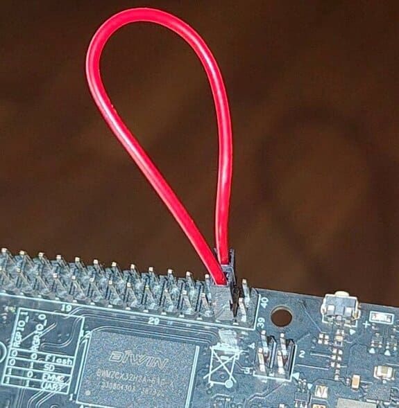

# Урок 05: GPIO

← [Урок 04](../lab04-kernel-module/README.md) · [На главную](../INDEX.md)

---

## Цель урока

GPIO (General Purpose Input/Output) — простейший периферийный интерфейс:
каждый пин либо читает логический уровень с внешней цепи, либо устанавливает
его. За этой простотой скрыта нетривиальная инфраструктура ядра: GPIO-подсистема,
pinctrl, обработка прерываний, несколько уровней абстракции.

Урок выстроен по методологии курса: сначала теория с TRM, затем виртуальный
GPIO без железа, затем реальные пины с программным осциллографом, на каждом
шаге — ftrace.

---

## Модули

| Модуль | Тема |
|--------|------|
| [module1-theory.md](module1-theory.md) | Теория: регистры GPIO-контроллера JH7110, подсистема ядра |
| [module2-virtual-gpio.md](module2-virtual-gpio.md) | Виртуальный GPIO: `gpio-mockup` + debugfs |
| [module3-sysfs-gpio.md](module3-sysfs-gpio.md) | Legacy-интерфейс `/sys/class/gpio` (deprecated) |
| [module4-driver-gpio.md](module4-driver-gpio.md) | Модуль ядра: loopback OUT→IN, gpiod API |
| [module5-pwm-generator.md](module5-pwm-generator.md) | Программный ШИМ: модуль ядра генерирует меандр, управление через sysfs |
| [module6-terminal-scope.md](module6-terminal-scope.md) | Терминальный осциллограф: ASCII-визуализация сигнала в реальном времени |
| [module7-oscilloscope.md](module7-oscilloscope.md) | Наблюдение сигнала на осциллографе + ftrace |

---

## Что понадобится

- Плата с ALT Linux, заголовки ядра установлены
- Один провод dupont для соединения пинов 37 и 38 как на картинке ниже:



```
          GPIO40 разъём VisionFive2
   (вид сверху, кнопка вкл. питания снизу)

  ┌─────────────────────────────────────┐
  │  ...  33 ○           ○ 34  ...      │
  │  ...  35 ○           ○ 36  ...      │
  │       37 ● GPIO60  GPIO61 ● 38      │
  │  ...  39 ○           ○ 40  ...      │
  └─────────────────────────────────────┘

                         ████
                 (кнопка вкл. питания)


        37 ● GPIO60──GPIO61 ● 38
           │  OUT──────IN   │
           │                │
           └──── dupont ────┘

  ● — используемый пин
  ○ — неиспользуемый
  ── — провод dupont
```
  - пин 37 = **GPIO60** (выход OUT)
  - пин 38 = **GPIO61** (вход IN)

- Начиная с module7: осциллограф, щупы

```bash
$ mkdir -p ~/labs/lab05
$ cd ~/labs/lab05
```

---

[Начнём →](module1-theory.md)
