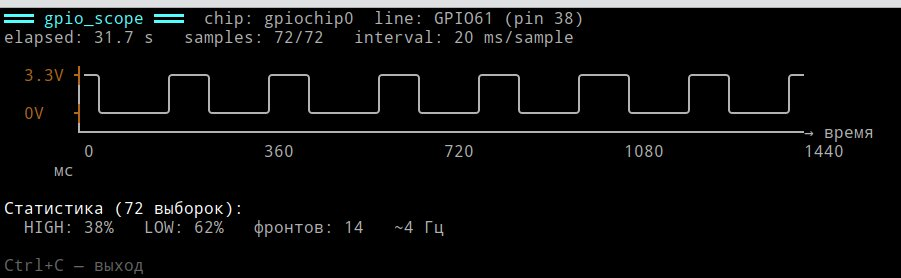
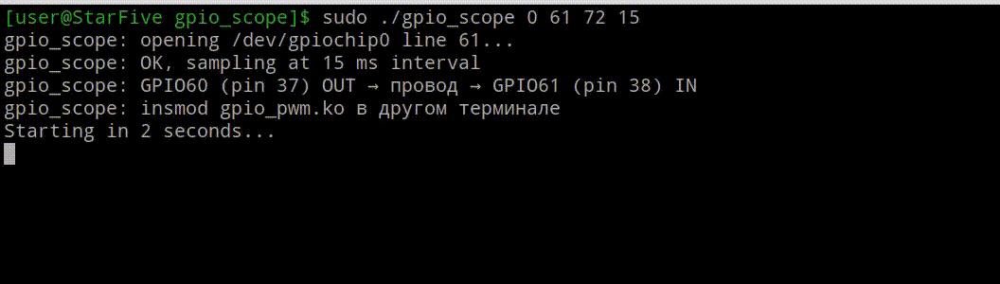

# module6 · Терминальный осциллограф: ASCII-визуализация GPIO в реальном времени

← [Назад](module5-pwm-generator.md) · [На главную](../INDEX.md) · [Следующий →](module7-oscilloscope.md)

---

## Идея: два терминала — генератор и осциллограф

```
  ┌───────────────────────────────┐   ┌─────────────────────────────────────┐
  │ Терминал 1: управление        │   │ Терминал 2: осциллограф             │
  │                               │   │                                     │
  │ $ echo 5  > frequency_hz      │   │  3.3V ┤─╮    ╭───╮    ╭───╮    ╭──  │
  │ $ echo 40 > duty_percent      │   │       │ │    │   │    │   │    │    │
  │ $ echo 1  > enable            │   │  0V   ┤ ╰────╯   ╰────╯   ╰────╯    │
  │                               │   │                                     │
  │ $ echo 10 > frequency_hz      │   │  HIGH: 40%  LOW: 60%  ~5 Гц         │
  └───────────────────────────────┘   └─────────────────────────────────────┘
```

Программа `gpio_scope` читает **GPIO61 (пин 38)** через `/dev/gpiochip0`
и рисует форму сигнала в реальном времени символами рамки Unicode.
Параллельно модуль `gpio_pwm` генерирует меандр на **GPIO60 (пин 37)**,
соединённом с GPIO61 через провод dupont.

---

## Схема [соединения](README.md#что-понадобится)

```
  пин 37  GPIO60  (OUT) ──┬──── gpio_pwm генерирует меандр
                          │
  пин 38  GPIO61  (IN)  ──┘     gpio_scope читает сигнал
                          ↑
              провод dupont — вынуть его в нужный момент!
```

---

## Пример вывода терминального осциллографа



Настройки: `frequency_hz=5`, `duty_percent=40`, `enable=1`.
Период сигнала 200 мс, HIGH-фаза 80 мс, LOW-фаза 120 мс.

```
═══ gpio_scope ═══  chip: gpiochip0  line: GPIO61 (pin 38)
elapsed: 31.7 s   samples: 72/72   interval: 20 ms/sample

  3.3V ┤─╮      ╭───╮     ╭───╮      ╭───╮     ╭───╮     ╭────╮     ╭───╮     ╭─
       │ │      │   │     │   │      │   │     │   │     │    │     │   │     │
  0V   ┤ ╰──────╯   ╰─────╯   ╰──────╯   ╰─────╯   ╰─────╯    ╰─────╯   ╰─────╯
       └────────────────────────────────────────────────────────────────────────→ время
        0                 360               720               1080              1440  мс

Статистика (72 выборок):
  HIGH: 38%   LOW: 62%   фронтов: 14   ~4 Гц
```

Что видно на осциллограмме:

- **HIGH: 38%, LOW: 62%** — close to 40/60: каждый HIGH-импульс занимает ~80 мс (4 выборки по 20 мс), LOW — ~120 мс (6 выборок).
- **~4 Гц** — статистика считает по целым периодам в видимом окне, реальная частота 5 Гц.
- **Символы фронтов:**
  - `╭` / `╯` — нарастающий фронт (0→1)
  - `╮` / `╰` — нисходящий фронт (1→0)
  - `─` — горизонтальный уровень (без изменений)
  - `│` — вертикальный переход между уровнями

---

## Код: gpio_scope.c

```bash
$ mkdir -p ~/labs/lab05/gpio_scope
$ cd ~/labs/lab05/gpio_scope
```

Файл `gpio_scope.c`:

```c
// gpio_scope.c — terminal oscilloscope: reads GPIO61, draws ASCII waveform
//
// Usage:
//   sudo ./gpio_scope [chip] [line] [width] [interval_ms]
//
//   chip        — GPIO chip number (default: 0  → /dev/gpiochip0)
//   line        — GPIO line number (default: 61 → GPIO61, pin 38)
//   width       — display width in columns (default: 72)
//   interval_ms — sampling interval in ms (default: 20 → 50 samples/s)
//
// Connect GPIO60 (pin 37) to GPIO61 (pin 38) with a dupont wire.
// Run gpio_pwm module in another terminal to generate signal.

#include <stdio.h>
#include <stdlib.h>
#include <string.h>
#include <unistd.h>
#include <fcntl.h>
#include <errno.h>
#include <time.h>
#include <signal.h>
#include <linux/gpio.h>
#include <sys/ioctl.h>

#define DEFAULT_CHIP        0
#define DEFAULT_LINE        61
#define DEFAULT_WIDTH       72
#define DEFAULT_INTERVAL_MS 20

static volatile int g_running = 1;

static void sigint_handler(int sig) { (void)sig; g_running = 0; }

static int open_gpio_line(int chip_num, unsigned int line_num)
{
	char chip_path[64];
	struct gpiohandle_request req;

	snprintf(chip_path, sizeof(chip_path), "/dev/gpiochip%d", chip_num);
	int chip_fd = open(chip_path, O_RDONLY);
	if (chip_fd < 0) { perror("open gpiochip"); return -1; }

	memset(&req, 0, sizeof(req));
	req.lineoffsets[0] = line_num;
	req.lines          = 1;
	req.flags          = GPIOHANDLE_REQUEST_INPUT;
	strncpy(req.consumer_label, "gpio_scope", sizeof(req.consumer_label) - 1);

	if (ioctl(chip_fd, GPIO_GET_LINEHANDLE_IOCTL, &req) < 0) {
		perror("GPIO_GET_LINEHANDLE_IOCTL");
		close(chip_fd);
		return -1;
	}
	close(chip_fd);
	return req.fd;
}

static int read_gpio_value(int line_fd)
{
	struct gpiohandle_data data;
	memset(&data, 0, sizeof(data));
	if (ioctl(line_fd, GPIOHANDLE_GET_LINE_VALUES_IOCTL, &data) < 0)
		return -1;
	return data.values[0];
}

/*
 * draw_frame — нарисовать один кадр осциллограммы.
 *
 * Три строки символов рамки:
 *
 *  HIGH row:  ──╮    ╭──────╮    ╭──
 *  MID  row:    │    │      │    │
 *  LOW  row:    ╰────╯      ╰────╯
 *
 * Правило для каждого столбца i:
 *   val==1, prev==1  → HIGH:─  MID:   LOW:
 *   val==0, prev==0  → HIGH:   MID:   LOW:─
 *   val==1, prev==0  → HIGH:╭  MID:│  LOW:╯  (нарастающий фронт)
 *   val==0, prev==1  → HIGH:╮  MID:│  LOW:╰  (нисходящий фронт)
 *
 * Использует \033[H (cursor home) — перерисовка без мерцания.
 * \033[2J вызывается один раз при старте.
 */
static void draw_frame(const int *samples, int count,
		       int width, long elapsed_ms,
		       int chip, int line, int interval_ms)
{
	int disp  = (count < width) ? count : width;
	int start = count - disp;

	/* Буферы для трёх строк: каждый символ до 3 байт UTF-8 */
	char *row_h = calloc(width * 4 + 4, 1);
	char *row_m = calloc(width * 4 + 4, 1);
	char *row_l = calloc(width * 4 + 4, 1);
	if (!row_h || !row_m || !row_l) {
		free(row_h); free(row_m); free(row_l);
		return;
	}

	for (int i = 0; i < disp; i++) {
		int val  = samples[start + i];
		int prev = (i > 0) ? samples[start + i - 1] : val;

		const char *h, *m, *l;

		if (val == 1 && prev == 1) {
			h = "\xe2\x94\x80";   /* ─ */
			m = " ";
			l = " ";
		} else if (val == 0 && prev == 0) {
			h = " ";
			m = " ";
			l = "\xe2\x94\x80";   /* ─ */
		} else if (val == 1 && prev == 0) {
			/* нарастающий фронт */
			h = "\xe2\x95\xad";   /* ╭ */
			m = "\xe2\x94\x82";   /* │ */
			l = "\xe2\x95\xaf";   /* ╯ */
		} else {
			/* нисходящий фронт */
			h = "\xe2\x95\xae";   /* ╮ */
			m = "\xe2\x94\x82";   /* │ */
			l = "\xe2\x95\xb0";   /* ╰ */
		}
		strcat(row_h, h);
		strcat(row_m, m);
		strcat(row_l, l);
	}

	/* Дополняем пробелами пока буфер заполняется */
	for (int i = disp; i < width; i++) {
		strcat(row_h, " ");
		strcat(row_m, " ");
		strcat(row_l, " ");
	}

	printf("\033[H");

	printf("\033[1;36m═══ gpio_scope ═══\033[0m  "
	       "chip: gpiochip%d  line: GPIO%d (pin %s)   \n",
	       chip, line, (line == 61) ? "38" : "?");

	printf("elapsed: %ld.%ld s   samples: %d/%d   interval: %d ms/sample   \n",
	       elapsed_ms / 1000, (elapsed_ms % 1000) / 100,
	       disp, width, interval_ms);

	printf("\n");

	printf("\033[33m  3.3V \xe2\x94\xa4\033[0m%s\n", row_h);
	printf("       \xe2\x94\x82%s\n",                row_m);
	printf("\033[33m  0V   \xe2\x94\xa4\033[0m%s\n", row_l);

	printf("       \xe2\x94\x94");
	for (int i = 0; i < width; i++)
		printf("\xe2\x94\x80");
	printf("\xe2\x86\x92 время\n");

	/* Временна́я шкала */
	printf("        ");
	{
		int step = width / 4;
		for (int j = 0; j <= width; j += step) {
			long t_ms = (long)(start + j) * interval_ms;
			char tbuf[20];
			snprintf(tbuf, sizeof(tbuf), "%ld", t_ms > 0 ? t_ms : 0);
			printf("%-*s", step, tbuf);
		}
	}
	printf("мс\n\n");

	/* Статистика */
	{
		int highs = 0, edges = 0;
		for (int i = 0; i < disp; i++) {
			if (samples[start + i] == 1) highs++;
			if (i > 0 && samples[start + i] != samples[start + i - 1])
				edges++;
		}
		int high_pct = disp > 0 ? highs * 100 / disp : 0;
		int freq_est = (edges >= 2 && disp > 0)
			? (edges / 2 * 1000) / (disp * interval_ms) : 0;

		printf("\033[1mСтатистика (%d выборок):\033[0m\n", disp);
		printf("  HIGH: %d%%   LOW: %d%%   фронтов: %d   ~%d Гц   \n",
		       high_pct, 100 - high_pct, edges, freq_est);
	}

	printf("\n\033[2mCtrl+C — выход\033[0m   \n");

	free(row_h); free(row_m); free(row_l);
	fflush(stdout);
}

int main(int argc, char *argv[])
{
	int chip_num    = DEFAULT_CHIP;
	int line_num    = DEFAULT_LINE;
	int width       = DEFAULT_WIDTH;
	int interval_ms = DEFAULT_INTERVAL_MS;

	if (argc > 1) chip_num    = atoi(argv[1]);
	if (argc > 2) line_num    = atoi(argv[2]);
	if (argc > 3) width       = atoi(argv[3]);
	if (argc > 4) interval_ms = atoi(argv[4]);

	if (width < 10 || width > 200) {
		fprintf(stderr, "width must be 10..200\n"); return 1;
	}
	if (interval_ms < 1 || interval_ms > 1000) {
		fprintf(stderr, "interval_ms must be 1..1000\n"); return 1;
	}

	signal(SIGINT,  sigint_handler);
	signal(SIGTERM, sigint_handler);

	printf("gpio_scope: opening /dev/gpiochip%d line %d...\n",
	       chip_num, line_num);

	int line_fd = open_gpio_line(chip_num, line_num);
	if (line_fd < 0) {
		fprintf(stderr, "Cannot open GPIO line.\n"
			"Check: ls -la /dev/gpiochip*\n"
			"Note: rmmod gpio_pwm if it holds this line.\n");
		return 1;
	}

	printf("gpio_scope: OK, sampling at %d ms interval\n", interval_ms);
	printf("gpio_scope: GPIO60 (pin 37) OUT → провод → GPIO61 (pin 38) IN\n");
	printf("gpio_scope: insmod gpio_pwm.ko в другом терминале\n");
	printf("Starting in 2 seconds...\n");
	sleep(2);

	int *samples = calloc(width, sizeof(int));
	if (!samples) { perror("calloc"); close(line_fd); return 1; }

	int count = 0, head = 0;

	struct timespec ts;
	clock_gettime(CLOCK_MONOTONIC, &ts);
	long t_start_ms = ts.tv_sec * 1000L + ts.tv_nsec / 1000000L;

	/* Очищаем экран один раз */
	printf("\033[2J\033[H");

	while (g_running) {
		int val = read_gpio_value(line_fd);
		if (val < 0) {
			fprintf(stderr, "\ngpio_scope: read error: %s\n",
				strerror(errno));
			break;
		}

		/* Кольцевой буфер */
		samples[head] = val;
		head = (head + 1) % width;
		if (count < width) count++;

		/* Линеаризуем для отрисовки */
		int *linear = malloc(count * sizeof(int));
		if (!linear) break;

		if (count < width) {
			memcpy(linear, samples, count * sizeof(int));
		} else {
			int part1 = width - head;
			memcpy(linear,         samples + head, part1 * sizeof(int));
			memcpy(linear + part1, samples,        head  * sizeof(int));
		}

		clock_gettime(CLOCK_MONOTONIC, &ts);
		long elapsed_ms = ts.tv_sec * 1000L + ts.tv_nsec / 1000000L - t_start_ms;

		draw_frame(linear, count, width, elapsed_ms,
			   chip_num, line_num, interval_ms);
		free(linear);

		struct timespec ts_sleep = {
			.tv_sec  = interval_ms / 1000,
			.tv_nsec = (interval_ms % 1000) * 1000000L,
		};
		nanosleep(&ts_sleep, NULL);
	}

	printf("\ngpio_scope: stopped.\n");
	free(samples);
	close(line_fd);
	return 0;
}
```

Файл `Makefile`:

```makefile
CC      = gcc
CFLAGS  = -Wall -Wextra -O2
TARGET  = gpio_scope

all: $(TARGET)

$(TARGET): gpio_scope.c
	$(CC) $(CFLAGS) -o $(TARGET) gpio_scope.c

clean:
	rm -f $(TARGET)
```

---

## Сборка

```bash
$ make
$ ls -lh gpio_scope
```

Предупреждений компилятора быть не должно.

---

## Запуск: пошаговая инструкция

### Шаг 1: убедиться что пины свободны

```bash
# Пин 37 (GPIO60) ↔ Пин 38 (GPIO61) — провод dupont
$ sudo gpioinfo -c gpiochip0 | grep -E "line  6[01]"
        line  60:       unnamed                 input
        line  61:       unnamed                 input
```

Оба пина должны быть свободными — если показывает `consumer=...`,
значит пин занят другим процессом или gpio_pwm уже загружен.

### Шаг 2: загрузить генератор (Терминал 1)

```bash
$ sudo insmod ~/labs/lab05/gpio_pwm/gpio_pwm.ko
$ dmesg | tail -6
[  399.474398] gpio_pwm: loaded
[  399.474407] gpio_pwm: GPIO60 (pin 37) = OUT (generator)
[  399.474410] gpio_pwm: generator thread started
[  399.474417] gpio_pwm: GPIO61 (pin 38) = IN  (loopback)
[  399.474420] gpio_pwm: sysfs at /sys/kernel/gpio_pwm/
[  399.474426] gpio_pwm: default: freq=1 Hz, duty=50%, disabled

# Установить параметры
$ echo 5  | sudo tee /sys/kernel/gpio_pwm/frequency_hz
$ echo 40 | sudo tee /sys/kernel/gpio_pwm/duty_percent
$ echo 1  | sudo tee /sys/kernel/gpio_pwm/enable
```

### Шаг 3: запустить осциллограф (Терминал 2)

```bash
$ cd ~/labs/lab05/gpio_scope
$ sudo ./gpio_scope
```

После 2 секунд экран очистится и начнёт прокручиваться осциллограмма.
---

## Как читать осциллограмму

```
  3.3V ┤─╮      ╭───╮     ╭───╮      ╭───╮
       │ │      │   │     │   │      │   │
  0V   ┤ ╰──────╯   ╰─────╯   ╰──────╯   ╰───
       └────────────────────────────────────→ время
        0         360         720         1080  мс
```

**Ось Y** — два уровня: `3.3V` (HIGH=1) и `0V` (LOW=0). GPIO — цифровой сигнал,
промежуточных значений нет.

**Ось X** — время в миллисекундах. Каждый столбец = один интервал дискретизации
(по умолчанию 20 мс). Окно 72 столбца = 1440 мс = 1.44 секунды.

**Символы фронтов:**

```
  ╭─  нарастающий фронт (0→1): сигнал перешёл в HIGH
  │
  ╯

  ╮   нисходящий фронт (1→0): сигнал перешёл в LOW
  │
  ╰─
```

**Статистика:**

```
  HIGH: 38%   LOW: 62%   фронтов: 14   ~4 Гц
  │           │           │              │
  │           │           │              └─ оценка частоты: фронтов/2 за окно
  │           │           └─ число переходов 0→1 и 1→0 за окно
  │           └─ процент времени в LOW
  └─ процент времени в HIGH (≈ duty_percent)
```

**Почему HIGH=38% при duty_percent=40?** Дискретизация 20 мс не совпадает
идеально с периодом сигнала (200 мс = 10 выборок). Если фронт попадает
между выборками — одна выборка может «срезаться». Это нормально.

**Почему ~4 Гц при frequency_hz=5?** Оценка считается по целым периодам
внутри видимого окна. При краях окна крайние полупериоды обрезаются.

---

## Управление параметрами в реальном времени (Терминал 1)

### Изменение частоты

```bash
# Медленный сигнал — широкие импульсы, хорошо видны фронты
$ echo 1 | sudo tee /sys/kernel/gpio_pwm/frequency_hz

# Быстрый сигнал — импульсы сужаются
$ echo 5  | sudo tee /sys/kernel/gpio_pwm/frequency_hz
$ echo 10 | sudo tee /sys/kernel/gpio_pwm/frequency_hz
$ echo 20 | sudo tee /sys/kernel/gpio_pwm/frequency_hz
```

При 20 Гц период = 50 мс = 2.5 выборки по 20 мс. Форма начнёт искажаться —
это **aliasing** (теорема Найквиста: нужно минимум 2× частоты дискретизации).

### Изменение скважности

```bash
$ echo 10 | sudo tee /sys/kernel/gpio_pwm/duty_percent  # короткий HIGH
$ echo 50 | sudo tee /sys/kernel/gpio_pwm/duty_percent  # меандр
$ echo 90 | sudo tee /sys/kernel/gpio_pwm/duty_percent  # длинный HIGH
```

### «Обрыв провода»

```
  1. Вынуть провод из пина 38 (GPIO61)
     → сигнал пропадает, осциллограф показывает LOW
  2. Вставить обратно
     → сигнал восстанавливается
```

Это наглядно демонстрирует что осциллограф в реальном времени отражает
физическое состояние пина.

---

## Аргументы командной строки

```
sudo ./gpio_scope [chip] [line] [width] [interval_ms]
```

| Параметр | По умолчанию | Описание |
|---|---|---|
| `chip` | 0 | Номер `/dev/gpiochipN` |
| `line` | 61 | Номер GPIO-линии |
| `width` | 72 | Ширина окна в столбцах |
| `interval_ms` | 20 | Интервал дискретизации, мс |

Примеры:

```bash
# Широкое окно — больше истории
$ sudo ./gpio_scope 0 61 120 20

# Более частая дискретизация — точнее фронты
$ sudo ./gpio_scope 0 61 72 10

# Медленная дискретизация — длинная история, меньше нагрузка
$ sudo ./gpio_scope 0 61 72 50
```

**Теорема Найквиста:** чтобы достоверно воспроизвести сигнал частотой F Гц,
интервал дискретизации должен быть ≤ 1/(2F) секунды. При `interval_ms=20`
максимальная «честная» частота = 25 Гц. Выше — форма искажается.

---

## Завершение

```bash
# Терминал 2: Ctrl+C

# Терминал 1:
$ echo 0 | sudo tee /sys/kernel/gpio_pwm/enable
$ sudo rmmod gpio_pwm
```

**Пример работы терминального осциллографа** `./gpio_scope 0 61 72 15` для отслеживания
следующей последовательности команд:
```bash
$ sudo insmod ~/labs/lab05/gpio_pwm/gpio_pwm.ko        &&\
  echo 5  | sudo tee /sys/kernel/gpio_pwm/frequency_hz &&\
  echo 50 | sudo tee /sys/kernel/gpio_pwm/duty_percent &&\
  echo 1  | sudo tee /sys/kernel/gpio_pwm/enable       &&\
  sleep 1                                              &&\
  echo 2  | sudo tee /sys/kernel/gpio_pwm/frequency_hz &&\
  sleep 1                                              &&\
  echo 10 | sudo tee /sys/kernel/gpio_pwm/duty_percent &&\
  sleep 1                                              &&\
  echo 90 | sudo tee /sys/kernel/gpio_pwm/duty_percent &&\
  sleep 1                                              &&\
  echo 0  | sudo tee /sys/kernel/gpio_pwm/enable
```


---

## Упражнения

1. Установить `frequency_hz=25`, `interval_ms=20` — наблюдать aliasing:
   форма сигнала начнёт выглядеть неправильно несмотря на то что сигнал
   генерируется корректно.

2. Установить `interval_ms=5` и `frequency_hz=40` — aliasing исчезнет:
   дискретизация стала достаточной.

3. Менять `duty_percent` от 10 до 90 и наблюдать как меняется соотношение
   HIGH/LOW в строке статистики.

4. Вынуть провод и вставить обратно — зафиксировать момент разрыва.

---

← [Назад](module5-pwm-generator.md) · [На главную](../INDEX.md) · [Следующий →](module7-oscilloscope.md)
