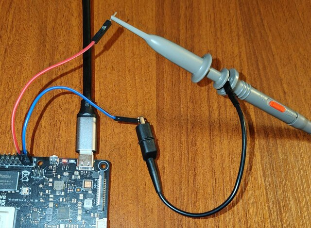
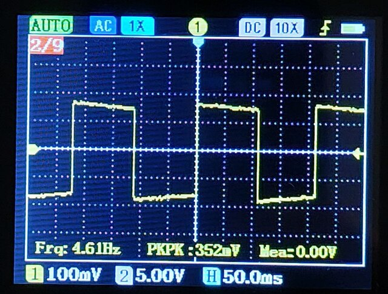

# module8 · Наблюдение сигнала на осциллографе + ftrace

← [Назад](module6-terminal-scope.md) · [На главную](../INDEX.md)

---

## Схема подключения



```
  VisionFive2 GPIO40 разъём          Осциллограф
  ──────────────────────────         ───────────
  пин 37  GPIO60  (OUT) ─────────── CH1 щуп
  пин 39  GND           ─────────── GND зажим CH1/CH2
```

Настройки осциллографа:
- **Развёртка:** 50–200 мс/дел (для наблюдения переключений из userspace)
- **Масштаб:** 1–2 В/дел
- **Триггер:** CH1, фронт (Rising), уровень ~1.5V
- **Связь:** DC

---

## Генерация сигнала через gpio_pwm

Самый удобный способ — использовать модуль из module5:

```bash
$ sudo insmod ~/labs/lab05/gpio_pwm/gpio_pwm.ko
$ echo 5 | sudo tee /sys/kernel/gpio_pwm/frequency_hz
$ echo 50 | sudo tee /sys/kernel/gpio_pwm/duty_percent
$ echo 1 | sudo tee /sys/kernel/gpio_pwm/enable
```

На осциллографе будет виден прямоугольный сигнал ~5 Гц (~200 мс период).
Менять частоту и скважность можно на лету через sysfs — изменение
немедленно будет отражаться на экране осциллографа.

Например, после выполнения команд выше, на портативном осциллографе
DSO2512G сигнал наблюдается так:



---

## Альтернатива: скрипт через gpioset

```bash
# Мигание через gpioset (неточное по частоте)
$ while true; do
   sudo gpioset -c gpiochip0 60=1
   sleep 0.1
   sudo gpioset -c gpiochip0 60=0
   sleep 0.1
 done
```

---

## Что наблюдается на осциллографе (подробно)

```
  CH1 (GPIO60, OUT):

  3.3V ─┐    ┌────┐    ┌────┐    ┌───
        │    │    │    │    │    │
  0V   ─┘────┘    └────┘    └────┘
             │←───────→│
        ~200 мс период (5 Гц)

  Характеристики:
  - Амплитуда: 0 — 3.3V (без нагрузки)
  - Фронт нарастания: < 10 нс при drive strength = 12 мА
  - Фронт спада: аналогично
  - Форма: прямоугольная
```

Если сигнала нет — проверить:
1. `sudo gpioinfo -c gpiochip0 | grep "line.*60"` — линия должна быть `output`
2. `sudo cat /sys/kernel/gpio_pwm/enable` — должно быть `1`
3. Щуп осциллографа — на пине 37, GND — на пине 39

---

## Корреляция ftrace и осциллограммы

Цель: увидеть временну́ю задержку между вызовом функции в ядре и реальным
изменением сигнала на пине.

### Шаг 1: включить трассировку с метками времени

```bash
$ sudo insmod ~/labs/lab05/gpio_pwm/gpio_pwm.ko

# Трассировать функции записи в GPIO
$ echo 'gpio_pwm* gpiod_set_value*' | \
    sudo tee /sys/kernel/debug/tracing/set_ftrace_filter

$ echo function | sudo tee /sys/kernel/debug/tracing/current_tracer
$ echo | sudo tee /sys/kernel/debug/tracing/trace
$ echo 1 | sudo tee /sys/kernel/debug/tracing/tracing_on

$ echo 2 | sudo tee /sys/kernel/gpio_pwm/frequency_hz
$ echo 1 | sudo tee /sys/kernel/gpio_pwm/enable
$ sleep 2

$ echo 0 | sudo tee /sys/kernel/debug/tracing/tracing_on
```

### Шаг 2: проанализировать временны́е метки

```bash
$ sudo cat /sys/kernel/debug/tracing/trace | grep "gpiod_set_value" | head -10
```

Пример вывода:

```
  gpio_pwm-1373    [001] .....  1641.129916: gpiod_set_value <-gpio_pwm_thread_fn
  gpio_pwm-1373    [001] .....  1641.129925: gpiod_set_value_nocheck <-gpiod_set_value
  gpio_pwm-1373    [001] .....  1641.405042: gpiod_set_value <-gpio_pwm_thread_fn
  gpio_pwm-1373    [001] .....  1641.405047: gpiod_set_value_nocheck <-gpiod_set_value
```

Разность временны́х меток между двумя вызовами (HIGH→LOW и LOW→HIGH) даёт
половину периода. При частоте 2 Гц ожидается ~250 мс между вызовами.

Интервалы между вызовами `gpiod_set_value` при 2 Гц, 50%:

`1641.405042 - 1641.129916 = 0.275126`

~275 мс вместо 250 мс — это нормальный jitter от `usleep_range(high_us, high_us + high_us/10 + 1)`

### Шаг 3: сравнить с осциллограммой

Период на осциллографе должен (при duty=50%) совпадать с удвоенным интервалом
между вызовами в ftrace. Расхождение показывает jitter планировщика ядра.

Потому что каждый вызов `gpiod_set_value` переключает пин — сначала HIGH,
потом LOW. Это **одна смена состояния = один полупериод**:

```
  gpiod_set_value(1)  ←── фронт 1→HIGH
  usleep(high_us)         ← 250 мс
  gpiod_set_value(0)  ←── фронт 2→LOW
  usleep(low_us)          ← 250 мс
  gpiod_set_value(1)  ←── фронт 3→HIGH ...
```

Из ftrace:
```
1641.129916: gpiod_set_value   ← HIGH
1641.405042: gpiod_set_value   ← LOW     интервал = 275 мс
1641.680168: gpiod_set_value   ← HIGH    интервал = 275 мс
```

Интервал между соседними вызовами = **полупериод**.
Период = два интервала = 550 мс ≈ 1/2 Гц.

При duty=40% HIGH-фаза и LOW-фаза разные, интервалы чередуются
~200 мс / ~300 мс, и формула «период = 2×интервал» не работает.

```bash
# Очистить
$ echo 0 | sudo tee /sys/kernel/gpio_pwm/enable
$ echo | sudo tee /sys/kernel/debug/tracing/set_ftrace_filter
$ echo nop | sudo tee /sys/kernel/debug/tracing/current_tracer
$ sudo rmmod gpio_pwm
```

---

## Итог урока GPIO

**Ключевые выводы:**

- GPIO в Linux доступны на трёх уровнях: sysfs (deprecated), libgpiod
  (userspace), gpiod API (kernel). Каждый уровень уместен в своём контексте.
- Программный ШИМ через kthread достаточен для частот до ~500 Гц; выше —
  нужен аппаратный ШИМ или hrtimer.
- Терминальный осциллограф показывает ограничения userspace-дискретизации:
  aliasing, задержки планировщика. Реальный осциллограф показывает
  аппаратный сигнал независимо от нагрузки CPU.
- ftrace позволяет коррелировать программные события ядра с физическим
  сигналом на пине.

---

← [Назад](module6-terminal-scope.md) · [На главную](../INDEX.md)
