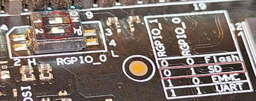
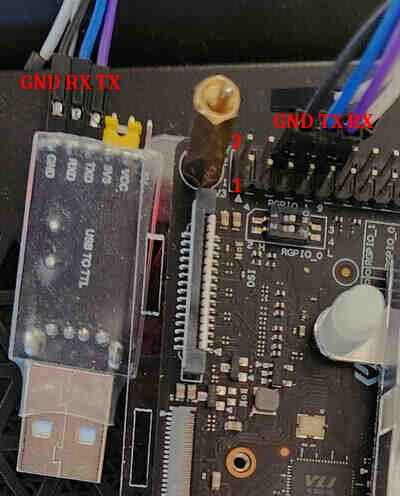

# Подготовка рабочего места

[На главную](INDEX.md)

---

## Содержание

1. [Подготовка образа ALT](#1-подготовка-образа-alt)
2. [Запись образа на micro-SD карту](#2-запись-образа-на-micro-sd-карту)
3. [Подключение к консоли](#3-подключение-к-консоли)
   - [Через UART](#31-подключение-через-uart-консоль)
   - [Через HDMI](#32-подключение-через-hdmi-консоль)
4. [Проверка IP-адреса и настройка SSH](#4-проверка-ip-адреса-и-настройка-ssh)
5. [Проверка окружения на плате](#5-проверка-окружения-на-плате)
6. [Установка инструментов](#6-установка-инструментов)
7. [Настройка окружения для сборки модулей](#7-настройка-окружения-для-сборки-модулей)
8. [Перенос корневой системы на NVMe SSD (опционально)](#8-Перенос-корневой-системы-на-NVMe-SSD-опционально)
9. [Правка образа (для разработчиков)](#9-правка-образа-для-разработчиков)

---

## 1. Подготовка образа ALT

Скачайте готовый образ по ссылке:
**https://drive.google.com/file/d/1EYy8IOPYLfwR-y8LBtrwSR2bKB41WAsQ/view?usp=sharing**
Сохраните архив в директорию `~/alt-visionfive2/image` и проверьте
контрольную сумму:

```bash
$ sha256sum regular-mate-latest-riscv64-visionfive2.img.tar.xz
# Ожидаемый результат:
# 4e8222513d8c354c64b817a667e9773a4af0726d665f3c83f9b230a9f7af594d
```

---

## 2. Запись образа на micro-SD карту

Подключите micro-SD карту **объёмом не менее 16 ГБ** к рабочей машине
и определите имя устройства (например, `/dev/sdX`).

> ⚠️ **Внимание:** команды ниже **безвозвратно уничтожат все данные**
> на указанном устройстве. Дважды проверьте имя устройства перед выполнением.

```bash
# Устанавливаем утилиты для работы с образом и разделами, а также консолью
$ sudo apt-get update
$ sudo apt-get install losetup dmsetup kpartx e2fsprogs cloud-utils screen putty

# Указываем устройство SD-карты (замените sdX на ваше)
$ DEVICE=/dev/sdX

# Стираем существующую таблицу разделов
$ sudo wipefs -a $DEVICE

# Переходим в каталог с образом, распаковываем архив и записываем на карту
$ cd ~/alt-visionfive2/image
$ tar -xf regular-mate-latest-riscv64-visionfive2.img.tar.xz
$ sudo dd if=./regular-mate-latest-riscv64-visionfive2.img of=$DEVICE bs=4M status=progress

# Расширяем корневой раздел (4-й) на всё свободное место карты
$ sudo growpart $DEVICE 4

# Проверяем файловую систему и применяем новый размер
$ sudo e2fsck -f ${DEVICE}4
$ sudo resize2fs ${DEVICE}4
```

---

## 3. Подключение к консоли

Перед первым включением питания платы **важно** правильно настроить
dip-переключатели (Boot Mode) - выставить режим **SD** как на картинке
ниже:



В этом режиме плата игнорирует содержимое QSPI (встроенная flash-память)
и загружает актуальные версии прошивки с MicroSD.

В противном случае плата может начать загрузку, используя устаревшие
компоненты из QSPI Flash. Это часто приводит к аппаратным ошибкам и
некорректному определению ресурсов платы.

> **Пример из практики:** При загрузке через заводской QSPI система
> может определить только **4 ГБ** оперативной памяти вместо
> положенных **8 ГБ**. Переключение в режим загрузки с **SD-карты**
> заставляет процессор использовать актуальные версии SPL и U-Boot
> из образа ALT Linux, которые корректно инициализируют контроллер
> памяти и весь объем RAM.

### 3.1 Подключение через UART-консоль



Отладочная консоль VisionFive 2 выведена на **40-пиновую гребёнку GPIO**
(UART0).

Используйте пины **6 (GND)**, **8 (TX)**, **10 (RX)**:

```
 Вид на GPIO-разъём сверху (порты USB смотрят на вас):
 ┌──────────────────────────────────────────────────────┐
 │ 2   4  [6]  [8]  [10]  12  14  ...  (внешний ряд)    │
 │ .   .  GND  TXD  RXD   .   .                         │
 │ 1   3   5    7    9    11  13  ...  (внутренний ряд) │
 └──────────────────────────────────────────────────────┘
           │    │    │
           │    │    └─── RX платы (пин 10) → TX адаптера
           │    └──────── TX платы (пин  8) → RX адаптера
           └───────────── GND      (пин  6) → GND адаптера
```

> **Параметры порта:** 115200 8N1 (8 бит данных, без паритета, 1 стоп-бит)

> **Логический уровень:** 3.3 В — адаптеры с уровнем 5 В использовать
> **нельзя**

> **Не подключайте VCC** от адаптера к плате, если она уже питается через USB-C

Открываем терминал на хост-машине:

```bash
# Вариант 1 — через screen
$ screen /dev/ttyUSB0 115200

# Вариант 2 — через putty
$ putty -serial /dev/ttyUSB0 -sercfg 115200,8,n,1,N
```

После включения питания в консоли появится вывод загрузчика U-Boot, затем
ядра. Если экран пуст — скорее всего, TX и RX перепутаны местами.

---

### 3.2 Подключение через HDMI-консоль

Подключите монитор через HDMI и включите питание платы. Лог загрузки ядра
будет отображаться на экране, после чего запустится графический менеджер с
окном приветствия.

---

## 4. Проверка IP-адреса и настройка SSH

### 4.1 Вход в систему

Доступны два пользователя:

| Логин  | Пароль |
|--------|--------|
| `user` | `1`    |
| `root` | `1`    |

Войдите под пользователем `user`.

---

### 4.2 Определение IP-адреса

Вывести список всех сетевых интерфейсов и их адресов:

```bash
$ ip a
```

Если нужен только IP-адрес конкретного интерфейса:

```bash
# Проводной интерфейс end0 (первый порт Ethernet)
$ ip addr show end0 | grep -Po 'inet \K[\d.]+'
# Пример вывода: 192.168.0.104

# Проводной интерфейс end1 (второй порт Ethernet, если подключён)
$ ip addr show end1 | grep -Po 'inet \K[\d.]+'
```

> Если адрес не отображается — проверьте подключение кабеля и работу
> DHCP на роутере.

---

### 4.3 Подключение по SSH

С хост-машины:

```bash
$ ssh user@<IP-адрес>
# или от root
$ ssh root@<IP-адрес>
```

Для удобства сразу добавьте публичный ключ, чтобы не вводить пароль при
каждом подключении:

```bash
$ ssh-copy-id user@<IP-адрес>
```

> Если `ssh-copy-id` недоступен, можно вручную скопировать содержимое
> `~/.ssh/id_rsa.pub` в файл `~/.ssh/authorized_keys` на плате.

---

## 5. Проверка окружения на плате

Убедитесь, что система загружена корректно и готова к работе:

```bash
# Проверяем версию ядра — должно быть 6.12.74-6.12-alt1.forge.rv64
$ uname -r

# Проверяем архитектуру — должно быть riscv64
$ uname -m

# Если `Makefile` существует — заголовки установлены и можно собирать модули ядра.
$ ls /lib/modules/$(uname -r)/build/Makefile

```

---

## 6. Установка инструментов

Устанавливаем компилятор, отладчики и библиотеки для работы с GPIO и I2C:

```bash
$ sudo apt-get update
$ sudo apt-get install -y \
      gcc make git \
      strace gdb \
      i2c-tools \
      gpio-tools \
      libgpiod2 \
      libgpiod-devel \
      trace-cmd \
      busybox \
      dtc
```
---

## 7. Настройка окружения для сборки модулей

Создаём рабочую директорию для лабораторных работ:

```bash
$ mkdir -p ~/labs
$ cd ~/labs
```

Задаём переменную `KDIR`, которая указывает на заголовки текущего ядра.
Она используется в каждом `Makefile` курса:

```bash
$ export KDIR=/lib/modules/$(uname -r)/build

# Проверяем, что путь существует и корректен
$ echo $KDIR
$ ls $KDIR/Makefile
```

Чтобы переменная устанавливалась автоматически при каждом входе в систему:

```bash
$ echo 'export KDIR=/lib/modules/$(uname -r)/build' >> ~/.bashrc
```

---

## 8. Перенос корневой системы на NVMe SSD (опционально)
Если в плату установлен NVMe SSD, можно перенести на него корневую
файловую систему — это значительно ускорит сборку модулей и работу
с файлами по сравнению с SD-картой.

> В примерах ниже используется расположение из реального стенда:

> — SD-карта: `/dev/mmcblk1p4` (текущий корень `/`)

> — NVMe-раздел: `/dev/nvme0n1p1` (будущий корень)

---

### 8.1 Подготовка NVMe-раздела

Проверяем текущее состояние диска — он должен быть виден как блочное
устройство без разделов:

```bash
$ lsblk /dev/nvme0n1
# Ожидаемый вывод:
NAME    MAJ:MIN RM   SIZE RO TYPE MOUNTPOINTS
nvme0n1 259:0    0 238,5G  0 disk
```

Создаём GPT-таблицу разделов и один раздел на весь диск с помощью `sgdisk`:

```bash
# Устанавливаем sgdisk, если не установлен
$ sudo apt-get install gdisk

# Создаём новую GPT-таблицу и единственный раздел на весь диск:
# -Z        — обнуляем любую существующую разметку
# -n 1:0:0  — раздел №1, от первого свободного сектора до последнего
# -t 1:8300 — тип: Linux filesystem
# -c 1:root — имя раздела (необязательно, для наглядности)
$ sudo sgdisk -Z -n 1:0:0 -t 1:8300 -c 1:root /dev/nvme0n1

# Сообщаем ядру о новой таблице разделов
$ sudo partprobe /dev/nvme0n1

# Проверяем результат — должен появиться nvme0n1p1
$ lsblk /dev/nvme0n1
# Ожидаемый вывод:
NAME        MAJ:MIN RM   SIZE RO TYPE MOUNTPOINTS
nvme0n1     259:0    0 238,5G  0 disk 
└─nvme0n1p1 259:2    0 238,5G  0 part
```

Форматируем созданный раздел в ext4 и присваиваем метку `NVME_ROOT`
для удобной идентификации в `fstab`:

```bash
# ВНИМАНИЕ: команда уничтожит все данные на nvme0n1p1
$ sudo mkfs.ext4 -L NVME_ROOT /dev/nvme0n1p1
```

---

### 8.2 Монтирование NVMe-раздела

```bash
# Создаём точку монтирования
$ sudo mkdir -p /mnt/nvme

# Монтируем NVMe-раздел
$ sudo mount /dev/nvme0n1p1 /mnt/nvme

# Проверяем, что раздел примонтирован
$ df -h /mnt/nvme
# Ожидаемый вывод:
Файловая система Размер Использовано  Дост Использовано% Cмонтировано в
/dev/nvme0n1p1     234G         2,1M  222G            1% /mnt/nvme
```

---

### 8.3 Копирование корневой файловой системы через rsync

Копируем всё содержимое текущего корня на NVMe. Псевдофайловые системы
(`/proc`, `/sys`, `/dev`, `/run`) и точку монтирования самого NVMe
исключаем — их не нужно копировать:

```bash
$ sudo rsync -aAXHv \
      --exclude=/proc \
      --exclude=/sys \
      --exclude=/dev \
      --exclude=/run \
      --exclude=/tmp \
      --exclude=/mnt \
      / /mnt/nvme/
``` 

> Флаги `rsync`:

> `-a` — архивный режим (сохраняет права, владельцев, символьные ссылки, временны́е метки)

> `-A` — сохраняет ACL

> `-X` — сохраняет расширенные атрибуты

> `-H` — сохраняет жёсткие ссылки

> `-v` — подробный вывод прогресса

Копирование займёт несколько минут:
```bash
sent 6.431.074.481 bytes  received 3.252.438 bytes  15.867.637,28 bytes/sec
total size is 7.815.278.366  speedup is 1,21
```

По завершении проверяем, что файлы на месте:

```bash
$ ls /mnt/nvme
# Ожидается:
bin   etc   lib    lost+found  opt   sbin     srv  var
boot  home  lib64  media       root  selinux  usr
```

---

### 8.4 Правка /etc/fstab на NVMe

Открываем `fstab` на **скопированной** системе (не на текущей!):

```bash
$ sudo nano /mnt/nvme/etc/fstab
```

Находим строку с корневым разделом и заменяем метку `ROOT` на `NVME_ROOT`:

```
# Было:
LABEL=ROOT      /       ext4    defaults        1 1

# Стало:
LABEL=NVME_ROOT /       ext4    defaults        1 1
```

Итоговый `/etc/fstab` должен выглядеть примерно так:

```
proc            /proc           proc    nosuid,noexec,gid=proc                        0 0
devpts          /dev/pts        devpts  nosuid,noexec,gid=tty,mode=620,ptmxmode=0666  0 0
tmpfs           /tmp            tmpfs   nosuid                                        0 0
LABEL=NVME_ROOT /               ext4    defaults                                      1 1
UUID=6E3D-DECB  /boot/BOOT/     vfat    defaults                                      0 2
```

---

### 8.5 Правка загрузчика extlinux.conf

Открываем конфигурацию загрузчика:

```bash
$ sudo nano /boot/BOOT/extlinux/extlinux.conf
```

Комментируем старую строку `append` и добавляем новую — с корнем на NVMe:

```
default l0
menu title U-Boot menu
prompt 0
timeout 50

label l00
    menu label ALT Linux 6.12.44-6.12-alt1.forge.rv64
    linux  /6.12.44-6.12-alt1.forge.rv64/vmlinuz
    initrd /6.12.44-6.12-alt1.forge.rv64/initrd.img
    fdtdir /6.12.44-6.12-alt1.forge.rv64/

    # append root=/dev/mmcblk1p4 rw console=ttyS0,115200 console=tty0 earlycon rootwait stmmaceth=chain_mode:1 audit=0 selinux=0
    append root=/dev/nvme0n1p1 rw console=ttyS0,115200 console=tty0 earlycon rootwait stmmaceth=chain_mode:1 audit=0 selinux=0
```

> Старая строка закомментирована (`#`) — её легко восстановить, если
> что-то пойдёт не так.

---

### 8.6 Перезагрузка и проверка

Размонтируем NVMe и перезагружаем плату:

```bash
$ sudo umount /mnt/nvme
$ sudo reboot
```

После загрузки проверяем, что система работает с NVMe:

```bash
# Корневой раздел должен быть /dev/nvme0n1p1
$ findmnt /
# Ожидаемый вывод:
TARGET
  SOURCE         FSTYPE OPTIONS
/ /dev/nvme0n1p1 ext4   rw,relatime

# Дополнительная проверка через lsblk
$ lsblk -o NAME,MOUNTPOINT,LABEL
# Ожидаемый вывод:
NAME        MOUNTPOINT LABEL
mtdblock0              
mtdblock1              
mtdblock2              
mmcblk1                
├─mmcblk1p1            
├─mmcblk1p2            
├─mmcblk1p3 /boot/BOOT BOOT
└─mmcblk1p4            ROOTFS
nvme0n1                
└─nvme0n1p1 /          NVME_ROOT
```

Если загрузка не прошла и плата ушла в петлю — подключитесь через UART,
прервите загрузку в U-Boot и откатитесь на SD-карту, раскомментировав
исходную строку в `extlinux.conf`.

---

## 9. Правка образа (для разработчиков)

Этот раздел описывает, как смонтировать разделы `.img`-образа на
хост-машине, внести правки (например, подправить `extlinux.conf`)
и синхронизировать содержимое с рабочей SD-картой.

### 9.1 Подготовка точек монтирования

```bash
$ mkdir -p mnt_boot mnt_root sd_boot sd_root
```

### 9.2 Монтирование образа через loop-устройство

```bash
# Подключаем образ как loop-устройство
$ sudo losetup -f regular-mate-latest-riscv64-visionfive2.img

# Получаем имя устройства, которое было назначено образу
$ DEVICE=$(sudo losetup -a | grep regular-mate-latest-riscv64-visionfive2.img | awk '{print $1}' | tr -d ':')

# Создаём маппинг разделов через kpartx
$ sudo kpartx -a $DEVICE

# Извлекаем чистое имя устройства (например, loop0)
$ DEV_NAME=$(basename $DEVICE)

# Монтируем загрузочный и корневой разделы образа
$ sudo mount /dev/mapper/${DEV_NAME}p3 mnt_boot/
$ sudo mount /dev/mapper/${DEV_NAME}p4 mnt_root/
```

### 9.3 Монтирование рабочей SD-карты

```bash
# Замените /dev/sdX на фактическое устройство вашей SD-карты
$ sudo mount /dev/sdX3 sd_boot/
$ sudo mount /dev/sdX4 sd_root/
```

### 9.4 Копирование с SD-карты в образ

Используется для обновления образа из рабочей (уже настроенной)
системы на SD-карте.

```bash
# Полностью заменяем содержимое разделов образа содержимым SD-карты
$ sudo rm -rf mnt_boot/* mnt_root/*
$ sudo rsync -aAXvP sd_boot/ mnt_boot/
$ sudo rsync -aAXvP sd_root/ mnt_root/
```

> Флаг `-P` объединяет `--progress` и `--partial` — удобно для больших
> разделов.

Если нужно обновить только загрузочный раздел (например, изменился
`extlinux.conf` или ядро):

```bash
$ sudo rsync -aAXvP sd_boot/ mnt_boot/
```

### 9.5 Точечная правка файлов в образе

Если нужно только подправить конкретный файл без полной синхронизации —
например, параметры загрузчика:

```bash
$ sudo nano mnt_boot/extlinux/extlinux.conf
```

Пример корректного `extlinux.conf` с правильным порядком `console=` для
вывода лога на HDMI:

```
default l0
menu title U-Boot menu
prompt 0
timeout 50

label l0
    menu label ALT Linux 6.12.74-6.12-alt1.forge.rv64
    linux  /6.12.74-6.12-alt1.forge.rv64/vmlinuz
    initrd /6.12.74-6.12-alt1.forge.rv64/initrd.img
    fdtdir /6.12.74-6.12-alt1.forge.rv64/

    append root=/dev/mmcblk1p4 rw console=ttyS0,115200 console=tty0 earlycon rootwait stmmaceth=chain_mode:1 selinux=0 audit=0
```

> **Важно:** `console=tty0` должен стоять **последним** — именно к нему
> привязывается `/dev/console` для systemd и userspace, что обеспечивает
> полный лог загрузки на HDMI.

### 9.6 Размонтирование

```bash
$ sudo umount sd_boot/ sd_root/ mnt_boot/ mnt_root/

# Удаляем все device-mapper маппинги и отсоединяем loop-устройство
$ sudo dmsetup remove_all
$ sudo losetup -d $DEVICE
```

> Кстати, стоит иметь в виду: `dmsetup remove_all` убирает **все**
> device-mapper устройства в системе (включая LVM, если есть).
> Если на хост-машине используется LVM — безопаснее заменить на
> `sudo kpartx -d $DEVICE`, который удаляет только маппинги конкретного
> образа.

---

[На главную](INDEX.md)
